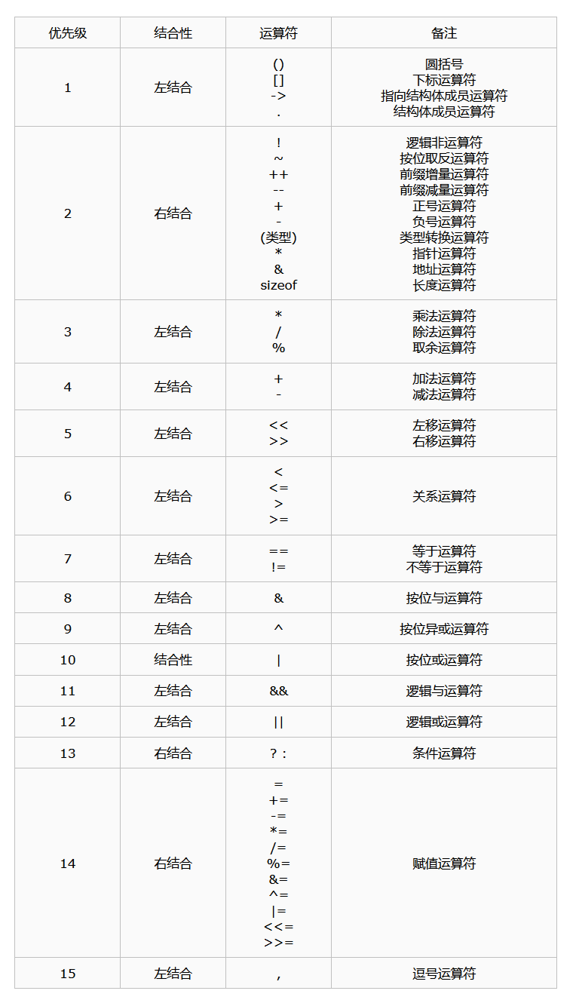

# 标识符命名规则

1.可以由**数字、字母、下划线_、美元符号$组成

2.不能以数字开头

3.不能是[关键字](https://so.csdn.net/so/search?q=%E5%85%B3%E9%94%AE%E5%AD%97&spm=1001.2101.3001.7020)

4.区分大小写

# 运算符的注意点

## 运算符的优先级



## 自增自减运算符（++和--）
特点：
- 前置，先加减再用值
- 后置，先用值再加减
- 兼有加减和赋值的功能，对象必须是**变量**，而**不能是常数或表达式**

## 取余运算符（%）

特点：
- 只适用于整型数

### 负数取余问题
自然数取余定义分两种：
- 如果a和d是两个自然数，d非零，可以证明存在两个唯一的整数 q 和 r，满足`a=qd+r且0 ≤ r < d`（其中q为商，r为余数）。
- 定义1一般作为数学中的取余法则，即两个数取余，余数总是为正数。

举例：
5%3=3x1+2，==商为1，余数为2==  
(-5)%(-3)=(-3)x2+1，==商为2，余数为1==  
5%(-3)=(-3)x(-1)+2，==商为-1，余数为2==  
(-5)%3=3x(-2)+1，==商为-2，余数为1==
————————————————————————————————————————————————————————————————————————
- 如果a 与d 是整数，d 非零，那么余数 r 满足这样的关系：`a = qd + r , q 为整数，且0 ≤ |r| < |d|`。
- 定义2取余的结果就会导致出现两个余数了，比如5%(-3) = `(-3)x(-1)+2` = `(-3)x(-2)-1`，所以这里的余数2和-1都满足定义。我们把2称为正余数，-1成为负余数。通常，当除以d 时，如果正余数为r1，负余数为r2，那么有r1 = r2 + d。
- -所有语言和计算器都遵循了==尽量让商尽量靠近0==的原则，即5%(-3) 的结果为2而不是-1，(-5)%3的结果是-2而不是1。
- 两个异号的数取余之后的结果取决于分子的符号
举例如下：
![[Pasted image 20240518101723.png]]
## 逻辑运算符

逻辑运算符&&的优先级比||高，在一个逻辑表达式中若有多个&&和||，运算总是由左到右进行。当能求出整个逻辑表达式的值时将提前结束（**短路操作**）

## 逗号运算符
特点：
- 从左到右计算各表达式的值，并以最后一个表达式的值作为逗号表达式的值
```cpp
e1,e2,...,en

x=(a=1,b=3,++b,a+b);    //结果为5
```

# 输入输出
- std::cin和std::cout是==全局对象==
- printf是==函数==

# 变量与常量

## 字符常量
1.定义：字符常量是用单引号括起来的一个字符，如'a'、'1'、'='。字符常量储存在计算机的储存单元中，以ASCII码的形式储存。

2.特点：
- 字符常量只能用==单引号==括起来，不能用双引号或者其他符号
- 字符常量只能是单个字符，即单引号内只能有一个字符

3.转义字符：
转义字符是一种特殊的字符常量，有以下特点：
- 转义字符与反斜线'\\'开头，后面跟一个或者几个字符
- 转义字符有特定含义，不同于字符原有的意义

4.用字符的ASCII码表示的字符常量：
另外还可以用字符的ASCII码表示，即用反斜线'\\'开头，后跟字符的ASCII码，也称为转义序列表示法，具体方法如下：
- 用字符的八进制ASCII码，表示为:\\0dd  这里，0dd是八进制值（0可以省略）
- 用字符的十六进制ASCII码，表示为：\\xhh或Xhh  这里hh是两位十六进制值。如：'A','\\101'和'\\x41'都表示同一个字符常量。


# 逻辑语句

## switch语句

1.作用：一个 **switch** 语句允许测试一个变量等于多个值时的情况。每个值称为一个 case，且被测试的变量会对每个 **switch case** 进行检查。

2.语法：
```cpp
switch(expression){
    case constant-expression  :
       statement(s);
       break; // 可选的
    case constant-expression  :
       statement(s);
       break; // 可选的
  
    // 您可以有任意数量的 case 语句
    default : // 可选的
       statement(s);
}
```

3.规则：
- **switch** 语句中的 **expression** 必须是一个整型或枚举类型，或者是一个 class 类型，其中 class 有一个单一的转换函数将其转换为整型或枚举类型。
- 在一个 switch 中可以有任意数量的 case 语句。每个 case 后跟一个要比较的值和一个冒号。
- case 的 **constant-expression** 必须与 switch 中的变量具有相同的数据类型，且必须是一个常量或字面量。
- 当被测试的变量等于 case 中的常量时，case 后跟的语句将被执行，直到遇到 **break** 语句为止。
- 当遇到 **break** 语句时，switch 终止，控制流将跳转到 switch 语句后的下一行。
- 不是每一个 case 都需要包含 **break**。如果 case 语句不包含 **break**，控制流将会 _继续_ 后续的 case，直到遇到 break 为止。
- 一个 **switch** 语句可以有一个可选的 **default** case，出现在 switch 的结尾。default case 可用于在上面所有 case 都不为真时执行一个任务。default case 中的 **break** 语句不是必需的。
